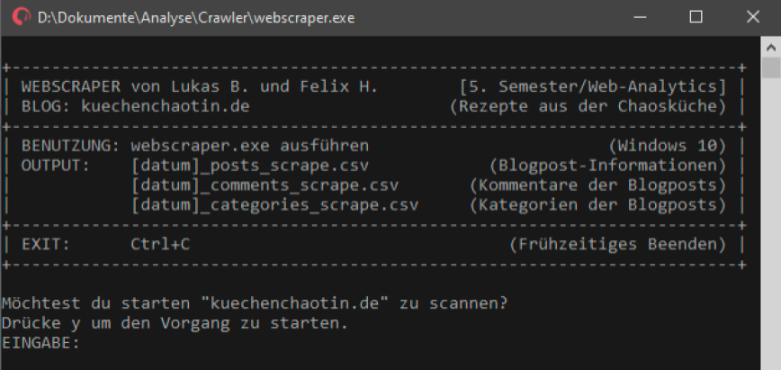
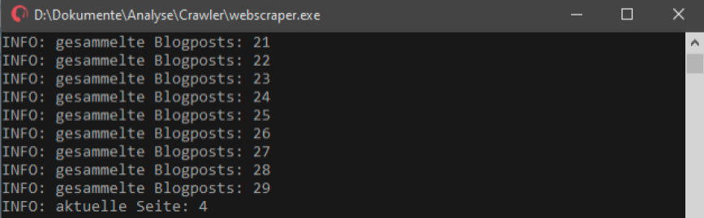

# blog-web-scraper

Blog Web Scraper built by Felix Hildebrandt as final thesis for Web Analytics in 2019. The fetched data was further analysed by Lukas Brueggemann as an extended group project for a Big Data science course.

> **_NOTE:_** Commentary and files might appear in German.

## Default Blog

By default, the web scraper is adapted to the blog of [Kuechenchaotin](https://kuechenchaotin.de/), a known German Food and Travel webpage. On demand, it could be customized for any other domain as this project is just a showcase.

## GUI Showcase on Windows

## Analytics

> The extended analysis based on the sample blog can be found within the `/metrics` folder. The structure is similar to this table of contents in the main description file.

### General Metrics

As stated, the tool can be used to measure value, sucess and outcome of different web blogs. Based on the script, following core value gains can be fetched:

- Conversation Rate in `Comments per Post`
- Outcome in `Post per Month`
- Content Created in `Words per Post`
- Blog Value
- Applied Business Models
- Social Media Communities

### Internal Metrics

Based on the sample data with over `600 posts`, there can be done various predictions, evaluations, and assessmentsand:

- Comment Count Predictions
- Comment Frequency
- Interaction Trendline
- Post Date Measures
- External Link Extraction
- Post Category Analysis

### External Metrics

Further, external sources like [SimilarWeb](https://www.similarweb.com/de/) can be used to combine internal and external metrics with traffic and search data from social media listings or referrals:

- Referring Traffic
- Search Visits
- Search Engagement
- Channel Analytics
- Demographics
- Traffic Share
- Browsing Categories
- Total Visits

## Tools

- [Auto Py to Exe](https://pypi.org/project/auto-py-to-exe/)
- [Microsoft Excel](https://www.microsoft.com/)
- [RapidMiner](https://rapidminer.com/)
- [SimilarWeb](https://www.similarweb.com/de/)
- [WEBUKA](https://www.webuka.com/)
- [WebsiteOutlook](https://www.websiteoutlook.com/)
