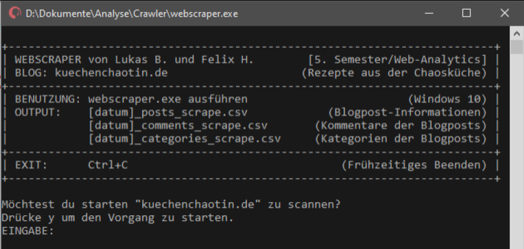
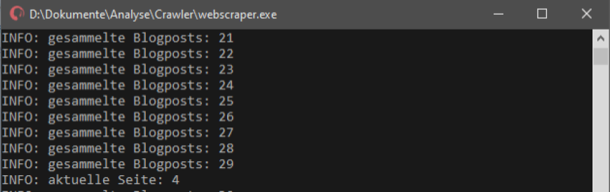

# blog-web-scraper

Blog Web Scraper built by Felix Hildebrandt as final thesis for Web Analytics in 2019. The fetched data was further analysed by Lukas Brueggemann as an extended group project.

> **_NOTE:_** The commentary and files might appear in German.

## Default Blog

By default, the web scraper is adapted to the blog of
[Kuechenchaotin](https://kuechenchaotin.de/), a known German Food and Travel webpage. On demand, it could be customized for any other domain.

## Windows GUI

## Tools

[Auto Py to Exe](https://pypi.org/project/auto-py-to-exe/)
